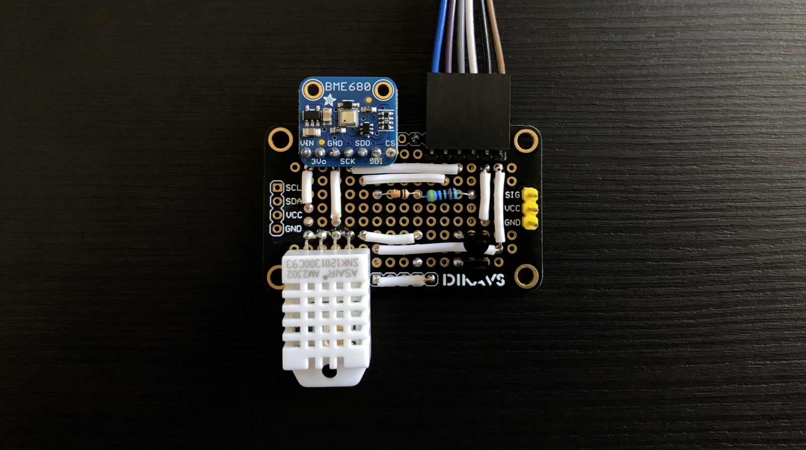
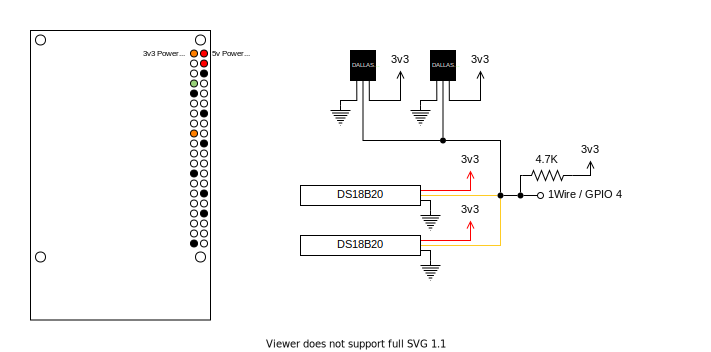
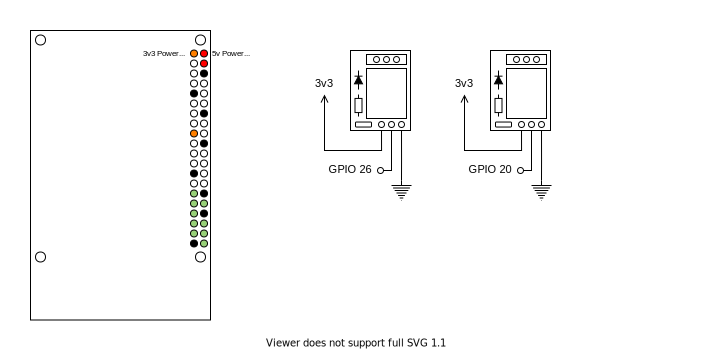

# Weather station: Raspberry Pi

Cloud based Raspberry Pi weather station

### Repositories

- [Cloud API](https://github.com/bartoszadamczyk/weather-station-cloud)
    - Web Client - Netlify, TypeScript, React, Immer, WebSockets, i18next, styled-components
    - Cloud API - Terraform, Serverless, AWS API Gateway (with WebSockets), DynamoDB, SQS, TypeScript, AJV
- [Raspberry Pi](https://github.com/bartoszadamczyk/weather-station-rpi) - Raspberry Pi, balena.io, Docker, Python,
  AsyncIO, SQS, Mypy, Black, Flake8



## Sensors and relays

- https://pinout.xyz/
- https://www.circuito.io/app
- https://lastminuteengineers.com/electronics/basic-electronics/

### DS18B20: Temperature Sensor

Fast, accurate, and cheap temperature sensor. You can't go wrong with that one. It is available standalone as well as a
pre-wired waterproof version.

- Depending on the housing and cable used it can measure a temperature from -55°C to +125° with a decent accuracy of
  ±0.5°C.
- Each sensor has a unique device ID.
- It can work with both 3.3v and 5v.
- Sensor is using 1-Wire protocol that can support multiple sensors connected to one GPIO.
- `GPIO 4` is used by default, you can connect all your sensors to one GPIO.
- Especially for longer cables pull up resistor of 4.7k-10k ohm is required.

You can get it on [The PiHut](https://thepihut.com/products/waterproof-ds18b20-digital-temperature-sensor-extras)
, [Adafruit](https://www.adafruit.com/product/381) or Amazon.



### DHT22: Temperature and Humidity Sensor

A basic sensor that is quite slow and buggy. On paper, you can get a reading every two seconds however protocol that is
used by this sensor is quite often crashing, hence in practice, you can the readings only a few times per minute.
Because of the errors in the protocol, the reading is sometimes incorrect. If you need just a temperature sensor, go for
DS18B20. If you got some extra budget go for the BME280 or BME680.

- Temperature readings in the range of -40 to 80°C with ±0.5°C accuracy.
- Humidity readings in the range of 0-100% with ±2-5% accuracy.
- It can work with both 3.3v and 5v.
- It requires one GPIO per one sensor together with the pull up resistor.
- This project suggest using `GPIO 17`, `GPIO 27`, `GPIO 22`, `GPIO 23` and `GPIO 24`.
- No unique id, GPIO number is used as an ID.
- Pull up resistor of 4.7k-10k ohm is required.

You can get it on [The PiHut](https://thepihut.com/products/dht22-temperature-humidity-sensor-extras)
, [Adafruit](https://www.adafruit.com/product/385), or Amazon.


### BME680: Temperature, Humidity, Pressure, Altitude and Gas Sensor

Overall very nice sensor, accurate, stable and versatile. On board chip is from Bosch, supports temperature, humidity,
pressure, altitude and gas, although last two require calibration.

You can get it
on [The PiHut](https://thepihut.com/products/adafruit-bme680-temperature-humidity-pressure-and-gas-sensor-ada3660)
and [Pimoroni](https://shop.pimoroni.com/products/bme680-breakout)


### Relays

You can use GPIOs as an output for your alarms. This can be used to control relays or other devices. **Remember to
protect your GPIOs! Don't connect relays directly to your Raspberry Pi. This is going to break your board!** You need
some transistors, diodes, resistors and preferably octocouplers to protect your device. If you don't want to build it
yourself, buy a ready-made relay board. Just remember to pick one compatible with Raspberry Pi 3v3 GPIOs, like the one
from [WaveShare](https://www.waveshare.com/wiki/RPi_Relay_Board).

- WaveShare Relay board is using `GPIO 26`, `GPIO 20`, `GPIO 21`.
- You can also use `GPIO 19`, `GPIO 16`, `GPIO 13`, `GPIO 6`, `GPIO 12` and `GPIO 5`.

You can get it on [The PiHut](https://thepihut.com/products/raspberry-pi-relay-board) or Amazon.



## Development

### Install dependencies:

```shell
pip install -r requirements.txt
```

### Save Dependencies

```shell
pip freeze > requirements.txt
```

### Run app

```shell
python -m app
```

### Run dev

```shell
black . && flake8 && mypy -m app
```


